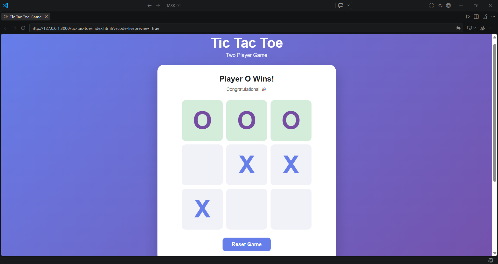
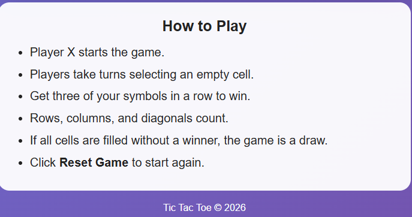

# 🎮 Tic Tac Toe Game

A simple and responsive **two-player Tic Tac Toe game** built using **HTML, CSS, and JavaScript**.

The game can be played directly in a web browser without requiring any additional software or backend.

## 🚀 Live Demo

Add your deployed project link here after deploying it using GitHub Pages:

**Live Demo:** `https://your-username.github.io/tic-tac-toe/`

---

## 📌 Features

* 🎮 Two-player browser game
* ❌ Player X vs Player O
* 🔲 Interactive 3×3 game board
* 🏆 Automatic win detection
* 🤝 Draw detection
* 🔄 Reset game functionality
* 👤 Clear indication of the current player's turn
* 📱 Fully responsive mobile-friendly UI
* 🎨 Clean and modern interface
* ♿ Uses buttons for keyboard-accessible game cells
* ⚡ No external libraries or frameworks required

---

## 🛠️ Technologies Used

| Technology | Purpose                       |
| ---------- | ----------------------------- |
| HTML5      | Game structure                |
| CSS3       | Styling and responsive design |
| JavaScript | Game logic and interaction    |

---

## 📂 Project Structure

```text
tic-tac-toe/
│
├── index.html
├── style.css
├── script.js
├── README.md
└── .gitignore
```

---

## 🎯 How to Play

1. Player X starts the game.
2. Player X selects any empty cell.
3. Player O takes the next turn.
4. Players continue taking turns.
5. The first player to get three symbols in a row wins.

Winning combinations can be:

* Horizontal
* Vertical
* Diagonal

If all nine cells are filled and nobody wins, the game ends in a draw.

---

## 🔄 Resetting the Game

Click the **Reset Game** button at any time to:

* Clear the board
* Reset the current player to X
* Remove the previous winner
* Start a new game

---

## 💻 How to Run Locally

### 1. Clone the repository

```bash
git clone https://github.com/your-username/tic-tac-toe.git
```

### 2. Open the project

```bash
cd tic-tac-toe
```

### 3. Run the game

Simply open:

```text
index.html
```

in any modern web browser.

No installation or server is required.

---

## 🌐 Deploy Using GitHub Pages

1. Create a new GitHub repository named:

```text
tic-tac-toe
```

2. Upload these files:

```text
index.html
style.css
script.js
README.md
.gitignore
```

3. Open the repository on GitHub.

4. Go to:

```text
Settings → Pages
```

5. Under **Build and deployment**, select:

```text
Source: Deploy from a branch
Branch: main
Folder: / (root)
```

6. Click **Save**.

GitHub will provide your live website URL.

---

## 📸 Screenshots / GIF

Add screenshots or a GIF of the working game here.

Example:

```markdown

```



For a GIF:


Recommended repository structure:

```text
tic-tac-toe/
│
├── screenshots/
│   ├── game.png
│   └── gameplay.gif
│
├── index.html
├── style.css
├── script.js
├── README.md
└── .gitignore
```

---

## 🧠 Game Logic

The game stores the board using a JavaScript array:

```javascript
["", "", "", "", "", "", "", "", ""]
```

There are eight possible winning combinations:

```text
0 1 2
3 4 5
6 7 8
```

The game checks:

* Rows
* Columns
* Main diagonal
* Reverse diagonal

After every move, JavaScript checks whether the current player has completed one of these combinations.

---

## 🔮 Future Improvements

Possible future features include:

* Single-player mode against AI
* Score tracking
* Player name input
* Sound effects
* Dark mode
* Game history
* Difficulty levels
* Animated winning lines

---

## 👨‍💻 Author

**Arpit Singh**

GitHub: Add your GitHub profile link here.

LinkedIn: Add your LinkedIn profile link here.

---

## 📄 License

This project is open-source and available for educational purposes.
